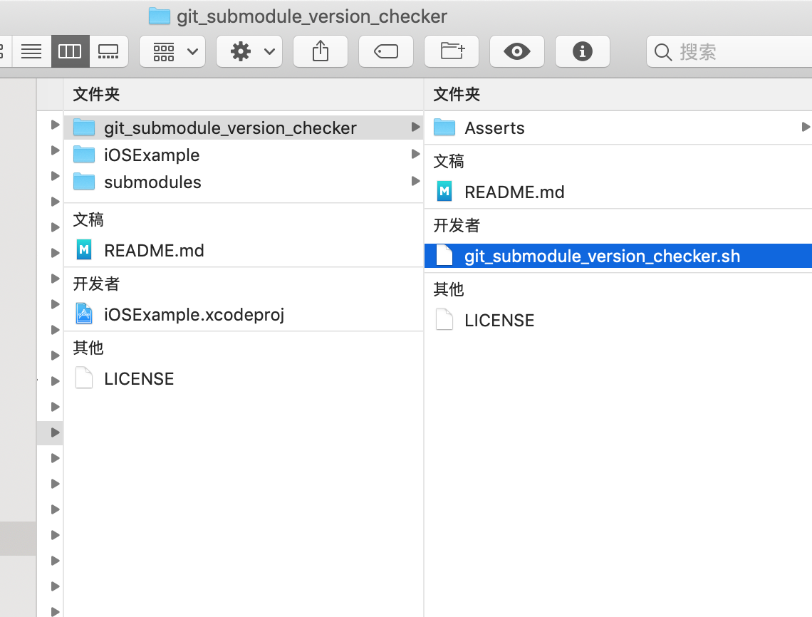
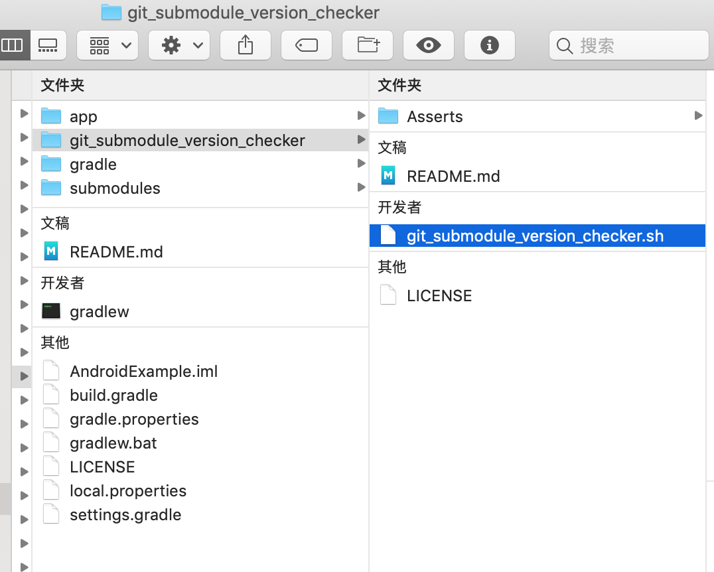

git_submodule_version_checker 
============

## 关于`git_submodule_version_checker.sh`

`git_submodule_version_checker.sh` 是一个git的submodule版本检测工具，用于帮助主工程检测其所依赖的子模块版本和子模块的仓库实际指向的版本是否一致。

按照下述教程，接入`git_submodule_version_checker`到主工程后，每次进行编译前，都会自动对子模块的版本进行检查，若主工程依赖的子模块的版本和子模块仓库实际指向的版本不一致，则编译会以失败结束。


## iOS主工程接入`git_submodule_version_checker`

接入步骤如下：

1. 下载[git_submodule_version_checker](https://github.com/YK-Unit/git_submodule_version_checker/archive/master.zip)，放置到主工程根目录，如图：

   

   

2. 用Xcode打开主工程的，选择`主工程Target > Build Phase > + `，如图所示新建一个名为`[CP] Check Git Submodule Version`的`Run Script Phase`：

   

   

   - `Run Script Phase`代码：

      ``` shell
      root_dir=$SRCROOT
      sh $root_dir/git_submodule_version_checker/git_submodule_version_checker.sh $root_dir
      if [ $? != 0 ]
      then 
      echo "error: This main repo has bad submodules, please run 'git submodule update --init --recursive' to fix it" >&2
      exit 1
      fi
      echo "SUCCESS"
      
      ```

   - 注意和红框一样，反选`Show environment variables in build log`和`Run script only when installing`


## Android主工程接入`git_submodule_version_checker`

接入步骤如下：

1. 下载[git_submodule_version_checker](https://github.com/YK-Unit/git_submodule_version_checker/archive/master.zip)，放置到主工程根目录，如图：

   

   

2. 用Android Studio 打开主工程，选择`主工程 > app > build.gradle `，如图所示添加名为`check_git_submodule_version`的`task`，并为`preBuild`这个task设置依赖：

   

   ​	

   上述添加的完整代码如下：

   ```groovy
   task check_git_submodule_version(type: Exec) {
       def root_dir = getRootDir()
       executable "sh"
       args "$root_dir/git_submodule_version_checker/git_submodule_version_checker.sh", "$root_dir"
   
       ignoreExitValue true
   
       doLast {
           logger.lifecycle("check result: $execResult")
   
           if(execResult.exitValue == 0) {
               logger.lifecycle('SUCCESS')
           } else {
               throw new GradleException("This main repo has bad submodules, please run \'git submodule update --init --recursive\' to fix it.")
           }
       }
   
   }
   
   preBuild.dependsOn check_git_submodule_version
   ```


## Examples

以下是接入了`git_submodule_version_checker`工具的示例：

- [iOS Example](https://github.com/YK-Unit/git_submodule_version_checker_example_iOS)
- [Android Example](https://github.com/YK-Unit/git_submodule_version_checker_example_Android)

PS：你可以使用这些示例对工具进行测试。

